# Hermes 架构依赖图谱

> 生成时间：2026-05-26 | 覆盖范围：~/.hermes 全目录（3.1GB，66K+ 文件）

---

## 一、核心依赖图

### 1.1 入口链：config.yaml 为总闸

```
                    ┌─────────────────────────────────────────────────────┐
                    │                  config.yaml                        │
                    │  model / providers / delegation / feishu / cron     │
                    │  memory / skills / kanban / sessions / curator      │
                    └──────┬──────────────────────────────────────────────┘
                           │
        ┌──────────────────┼──────────────────┐
        ▼                  ▼                  ▼
   models.yaml      agent-registry.json    managed-agents.yaml
  (模型路由定义)     (Agent 注册表+bridge)   (Agent 编制声明)
        │                  │                  │
        │          ┌───────┴───────┐          │
        │          ▼               ▼          ▼
        │   agents.yaml     policy.yaml   routes.yaml
        │  (Agent 详细)    (优先级策略)   (任务路由)
        │          │               │          │
        │          └───────┬───────┘          │
        │                  ▼                  ▼
        │           review_rules.yaml   kanban_bridge.yaml
        │           (审查触发条件)       (看板状态机)
        │
        ▼
   credential_pool (via config.yaml providers / delegation)
        │
        ▼
   auth.json  (实际密钥存储 — OAuth tokens / API keys)
```

### 1.2 全局架构俯瞰 (Mermaid)

```mermaid
graph TB
    subgraph "入口层 Entry"
        SOUL["SOUL.md<br/>身份与边界"]
        CONFIG["config.yaml<br/>总配置"]
        AUTH["auth.json<br/>凭据池"]
    end

    subgraph "Agent 编制层 Registry"
        REGISTRY["agent-registry.json<br/>Agent 注册表 + 路由规则"]
        AGENTS["agents.yaml<br/>Agent 编制声明"]
        MANAGED["managed-agents.yaml<br/>Managed 代理桥接"]
    end

    subgraph "策略层 Policy"
        MODELS["models.yaml<br/>模型定义 + 路由规则"]
        ROUTES["routes.yaml<br/>任务 → Agent 路由"]
        POLICY["policy.yaml<br/>优先级策略"]
        REVIEW["review_rules.yaml<br/>审查门禁"]
        KANBAN["kanban_bridge.yaml<br/>看板状态机"]
    end

    subgraph "技能层 Skills"
        SKILLS_DIR["skills/ (60 SKILL.md)<br/>可复用工作流"]
        CORE_SKILLS["HERMES_CORE_SKILLS<br/>主 Agent 白名单"]
    end

    subgraph "执行层 Runtime"
        GATEWAY["gateway/<br/>消息网关 (飞书为主)"]
        CRON["cron/<br/>定时任务调度"]
        DELEGATE["delegate_task<br/>子 Agent 委托"]
        SESSION["hermes_state.py<br/>SessionDB"]
    end

    subgraph "持久层 Persistence"
        MEMORY["memories/MEMORY.md<br/>每轮注入事实"]
        USER_PROFILE["memories/user-profile.md<br/>用户偏好"]
        STATE_DB["state.db<br/>系统状态"]
        EVENTS_DB["events.db<br/>事件日志"]
        KANBAN_DB["kanban.db<br/>看板数据"]
        SESSIONS_DB["sessions.db<br/>会话存储"]
    end

    subgraph "工具链 Tools"
        TOOLS_DIR["tools/*.py<br/>工具实现"]
        PLUGINS["plugins/<br/>可插拔模块"]
        GATEWAY_DIR["gateway/platforms/<br/>平台适配器"]
    end

    CONFIG --> REGISTRY
    CONFIG --> MODELS
    CONFIG --> GATEWAY
    CONFIG --> CRON
    CONFIG --> SESSION
    CONFIG --> MEMORY

    SOUL --> REGISTRY
    AUTH --> MODELS

    REGISTRY --> AGENTS
    REGISTRY --> MANAGED
    REGISTRY --> ROUTES
    REGISTRY --> POLICY

    AGENTS --> MODELS
    ROUTES --> REVIEW
    ROUTES --> KANBAN

    REGISTRY --> SKILLS_DIR
    REGISTRY --> CORE_SKILLS

    REGISTRY --> DELEGATE
    GATEWAY --> SESSION
    CRON --> DELEGATE
    DELEGATE --> TOOLS_DIR

    MEMORY --> SESSION
    STATE_DB --> SESSION
    KANBAN_DB --> KANBAN
```



---

## 二、Agent 体系链路

### 2.1 引用链（完整追踪）

```
config.yaml
  ├── model.default → deepseek-v4-pro
  ├── delegation.model → deepseek-v4-flash
  ├── feishu.channel_prompts → 各频道 Prompt
  └── (隐式加载)
       │
       ▼
config/models.yaml                                    ← 模型定义，被各 Agent model_ref 引用
  ├── deepseek_flash   (role: primary_hermes)
  ├── deepseek_pro     (role: complex_reasoning)
  ├── claude_opus      (role: primary_claude_code)
  ├── codex_cli        (role: coding_executor)
  └── tars_gpt54       (role: desktop_operator)
       │
       ▼
config/agent-registry.json                            ← 注册表（JSON，generated_from agents.yaml）
  ├── schema_version: "1.0"
  ├── source_of_truth → agents.yaml
  ├── agents[8]      (各 Agent 详细定义)
  └── routing_rules  (capability → agent_id 映射)
       │
       ├── agent-registry.json 是桥接文件：
       │   - 读取 agents.yaml 生成
       │   - 包含 routing_rules（capability → agent 映射）
       │   - 每个 agent 有 subagent_profile（toolsets, blocked_tools, isolation, model_ref）
       │
       ▼
config/managed-agents.yaml                            ← 高层编制声明（简洁版）
  ├── agents[8]  (agent_id, role, model_ref, skills, tools, permission)
  └── routing:  (default_route, fallback_route, rules)
       │
       ▼
hermes-agent/configs/managed_agents/
  ├── agents.yaml           ← 详细编制（与 managed-agents.yaml 同源）
  ├── routes.yaml           ← 任务路由表（task_category → owner_agent + reviewers）
  ├── policy.yaml           ← 策略优先级（safety > user > soul > managed > router > skill > agent）
  ├── review_rules.yaml     ← 审查触发条件（风险等级、文件数、路径匹配、操作类型）
  └── kanban_bridge.yaml    ← 看板状态机（10 状态：created → planned → ... → done/failed）
```

### 2.2 关键依赖关系

| 源文件 | 引用字段 | 目标 |
|--------|---------|------|
| `agent-registry.json` 每个 agent | `model_ref` | `models.yaml` 中的模型 key（如 `deepseek_pro`） |
| `agent-registry.json` 每个 agent | `subagent_profile.skills` | `skills/` 目录下的 SKILL.md 名称 |
| `agent-registry.json` 每个 agent | `subagent_profile.toolsets` | `toolsets.py` 中定义的 toolset |
| `agent-registry.json` 每个 agent | `subagent_profile.required_mcp_servers` | MCP server 配置（`codegraph`） |
| `models.yaml` 每个模型 | `api_key_env` | 环境变量名（如 `DEEPSEEK_API_KEY`） |
| `models.yaml` routing_rules | `models` 列表 | `models.yaml` 自身模型 key |
| `routes.yaml` | `owner_agent` | agent_id（如 `claude`, `hermes-internal`） |
| `routes.yaml` | `reviewers` | agent_id（如 `codex`, `ambrosini`） |
| `policy.yaml` priority_order | 优先级名称 | 系统各层的决策优先级 |

### 2.3 8 个 Agent 编制总览

| agent_id | 角色 | model_ref | permission | tools | skills 数 |
|----------|------|-----------|------------|-------|----------|
| `hermes-internal` | internal_reasoner | deepseek_pro | read_only | file, mcp-codegraph | 6 |
| `claude` | lead_implementer | claude_opus | ask | file, terminal, git, mcp-codegraph | 12 |
| `deepseek-tui` | fast_worker | deepseek_pro | ask | file, terminal | 7 |
| `codex` | principal_engineer | codex_cli | read_only | file, terminal, mcp-codegraph | 4 |
| `intelligence` | research_analyst | deepseek_flash | ask | file, web | 1 |
| `pirlo` | planning_strategist | deepseek_pro | read_only | file | 8 |
| `agent-tars` | desktop_operator | tars_gpt54 | ask | desktop, browser | 3 |
| `ambrosini` | quality_gate | deepseek_pro | read_only | file, mcp-codegraph | 2 |

### 2.4 路由规则（capability → agent 映射，来自 agent-registry.json）

```json
{
  "file_modification": "claude",
  "script_execution": "claude",
  "git_operations": "claude",
  "code_review": "codex",
  "implementation_planning": "codex",
  "technical_decomposition": "hermes-internal",
  "web_research": "intelligence",
  "file_reading_analysis": "hermes-internal",
  "desktop_control": "agent-tars",
  "content_writing": "pirlo",
  "review": "ambrosini",
  "validation": "ambrosini",
  "risk_assessment": "ambrosini"
}
```

### 2.5 任务路由矩阵（来自 routes.yaml）

| 任务类型 | 风险 | Planner | 执行 | 支持 | 审查 |
|---------|------|---------|------|------|------|
| explain_code | R0 | — | hermes-internal | — | — |
| tests | ≤R1 | — | deepseek-tui | — | codex |
| feature | R2 | codex | claude | deepseek-tui | codex |
| architecture_change | R3 | hermes-internal, codex | claude | deepseek-tui | codex, ambrosini |
| production/destructive | R4 | hermes-internal, codex | claude | — | ambrosini, codex |

---

## 三、Skill 体系链路

### 3.1 整体架构

```
skills/  (用户定义，60 SKILL.md，按类别分目录)
  ├── creative/       (creative tools: claude-design, comfyui, sketch, ...)
  ├── devops/         (kanban, html-anything, ...)
  ├── github/         (pr-workflow, code-review, issues, ...)
  ├── hermes/         (system-diagnostics, knowledge-architecture, cron, webui)
  ├── software-dev/   (debugging-*, spike, open-design-ops, ...)
  ├── research/       (competitive-intelligence, anysearch-lite)
  ├── productivity/   (feishu-operations, obsidian, airtable, ...)
  ├── media/          (spotify)
  ├── apple/          (macos-computer-use)
  ├── social-media/   (xurl)
  └── autonomous-ai-agents/ (browser-automation, chief-of-staff)
       │
       │ 软链接关系（部分）：
       │ skills/ 下的许多 skill 是软链接到 ../../.agents/skills/
       │ 例如：skills/staam-persona → ../../.agents/skills/staam-persona
       │ 这意味着 .agents/skills 是技能共享目录
       │
       ▼
hermes-agent/skills/  (内置 skills，随 Hermes 分发)
hermes-agent/optional-skills/  (可选，默认不激活)
.agents/skills/  (独立 agent 的技能共享目录)
       │
       │ SKILL.md frontmatter 声明：
       │   agents: [...]        → 指示此 skill 适用哪些 agent
       │   tools: [...]         → 指示此 skill 需要哪些工具
       │   requires_skill: [...] → skill 间依赖
       │
       ▼
agent-registry.json
  └── 每个 agent.subagent_profile.skills: [...]  ← Agent 的白名单 skills
       │
       ▼
prompt_builder.py
  └── HERMES_CORE_SKILLS  ← 主 Agent (马蒂尼) 的硬编码白名单
```

### 3.2 Skill 与 Agent 绑定（来自 agent-registry.json）

| Agent | 绑定的 Skills |
|-------|-------------|
| hermes-internal | hermes-subagent-delegation, hermes-multi-agent-research, hermes-gateway-debug, codebase-inspection, github-repo-risk-assessment, humanizer-zh |
| claude | github-pr-workflow, github-repo-management, github-issues, codebase-inspection, python-debugpy, node-inspect-debugger, nextjs-standalone-deployment, spike, open-design-ops, design-md, comfyui, html-anything |
| deepseek-tui | codebase-inspection, spike, python-debugpy, node-inspect-debugger, debugging-hermes-tui-commands, github-issues, anysearch-lite |
| codex | codex-superpowers, github-code-review, github-repo-risk-assessment, codebase-inspection |
| intelligence | competitive-intelligence |
| pirlo | humanizer, humanizer-zh, claude-design, sketch, baoyu-infographic, baoyu-comic, architecture-diagram, html-anything |
| agent-tars | browser-automation-for-blocked-sites, macos-computer-use, playwright-mcp |
| ambrosini | codex-superpowers, github-code-review |

### 3.3 Skill 共享矩阵

```
Shared skills (被多个 Agent 引用):
  codebase-inspection     → hermes-internal, claude, deepseek-tui, codex
  github-repo-risk-assessment → hermes-internal, codex
  github-issues           → claude, deepseek-tui
  spike                   → claude, deepseek-tui
  python-debugpy          → claude, deepseek-tui
  node-inspect-debugger   → claude, deepseek-tui
  humanizer-zh            → hermes-internal, pirlo
  html-anything           → claude, pirlo
```

### 3.4 Skill 之间的引用关系（SKILL.md 间依赖）

通过 `requires_skill` frontmatter 或文档内引用：

```
hermes-knowledge-architecture  → 引用 SOUL.md, MEMORY.md, hermes-authority-map.md
hermes-system-diagnostics      → 引用 hermes-runtime-runbook.md, MEMORY.md, gateway/
hermes-subagent-delegation     → 引用 agent-registry.json, managed-agents.yaml
hermes-multi-agent-research    → 引用 agent-registry.json, routes.yaml
competitive-intelligence       → 引用 references/ 子目录（长时间运行的会话记录）
codebase-inspection            → 使用 pygount 工具
github-pr-workflow             → 使用 gh CLI
```

---

## 四、Runtime 数据流

### 4.1 消息入口链路

```
飞书用户消息
  │
  ▼
gateway/run.py  (gateway 主进程，launchd: ai.hermes.gateway)
  │
  ├── gateway/platforms/feishu.py  (飞书适配器)
  │     ├── 读取 config.yaml → feishu 段
  │     ├── 读取 channel_prompts → 频道特定 Prompt
  │     └── 读取 channel_skill_bindings → 频道绑定 skill (如 staam-persona)
  │
  ├── gateway/session.py  (会话管理)
  │     ├── 创建/恢复 SessionContext
  │     ├── 加载 MEMORY.md + user-profile.md (每轮注入)
  │     └── 读取 agent-registry.json (加载 Agent 编制)
  │
  ▼
run_agent.py → AIAgent.chat() / run_conversation()
  │
  ├── 读取 SOUL.md (system prompt 基础)
  ├── 读取 config.yaml → agent 段 (max_turns, gateway_timeout, ...)
  ├── 读取 config.yaml → delegation 段 (子 Agent 参数)
  ├── 初始化 toolsets: 从 config.yaml platform_toolsets.feishu
  │     → [hermes-cli, desktop, mcp-codegraph]
  │
  ├── 工具调用循环 (最多 90 turns):
  │   │
  │   ├── model_tools.py → handle_function_call()
  │   │     └── 工具路由 → tools/*.py (各工具实现)
  │   │
  │   ├── delegate_task → 子 Agent 委托
  │   │     ├── delegate_tool.py
  │   │     ├── 读取 agent-registry.json (获取 subagent_profile)
  │   │     ├── 读取 models.yaml (model_ref → 模型解析)
  │   │     └── 创建子 Agent → run_agent.py (独立实例)
  │   │
  │   └── memory_tool.py → 记忆工具
  │         ├── 读取 MEMORY.md, user-profile.md
  │         └── 写入记忆 / 用户配置文件
  │
  └── 最终响应 → 飞书返回
```

### 4.2 定时任务 (Cron) 链路

```
config.yaml
  └── cron: { wrap_response: true, max_parallel_jobs: null }
       │
       ▼
hermes-agent/cron/scheduler.py
  │
  ├── 读取 cron-jobs.json (定时任务定义，存储在 state.db 或独立文件)
  │
  ├── 每个 cron job:
  │     ├── 创建独立 session (session_id = cron_{job_id})
  │     ├── 注入 skills (按 job 的 skills 数组)
  │     ├── 运行 AIAgent.chat(prompt)
  │     └── 结果通过 gateway 发送到飞书频道
  │
  └── 示例 job: 世界杯营销情报 (每天 10:00)
        ├── prompt: 情报官搜索世界杯营销动态
        ├── skills: []  (无额外 skill)
        └── schedule: "0 10 * * *"
```

### 4.3 看板 (Kanban) 链路

```
config.yaml
  └── kanban: { dispatch_in_gateway: true, dispatch_interval_seconds: 60, failure_limit: 2 }
       │
       ▼
hermes-agent/plugins/kanban/  (看板插件)
  │
  ├── kanban_bridge.yaml → 看板状态机 (10 状态)
  │
  └── kanban.db → 看板持久数据
       │
       ├── 自动创建条件: steps_gte=4, agents_gte=2, risk_gte=R2
       └── 跨 session 恢复: cross_session_recovery=true
```

### 4.4 Session 管理链路

```
hermes_state.py → SessionDB (SQLite + FTS5 全文搜索)
  │
  ├── sessions.db → 会话存储 (可 prune, retention_days=90)
  ├── state.db → 系统状态
  ├── events.db → 事件日志
  └── response_store.db → 响应缓存
       │
       └── session_search_tool.py → session_search()
             └── 用于跨 session 上下文恢复
```

---

## 五、持久层结构

### 5.1 文件角色矩阵

| 文件 | 类型 | 角色 | 读写 | 注入时机 |
|------|------|------|------|---------|
| `SOUL.md` | Markdown | 身份与边界定义 | 读 (手动编辑) | 每轮 system prompt |
| `MEMORY.md` | Markdown | 稳定事实（需每轮知道） | 读+写 (memory_tool) | 每轮 system prompt |
| `user-profile.md` | Markdown | 用户偏好（较长描述） | 读+写 (memory_tool) | 每轮 system prompt |
| `USER.md` | Markdown | 用户偏好（紧凑版） | 读+写 | 每轮注入 |
| `project-context.json` | JSON | 项目上下文 | 读 | 按需 |
| `feedback-memory.json` | JSON | 反馈记忆 | 读+写 | 按需 |
| `user-preferences.json` | JSON | 用户偏好结构化 | 读+写 | 按需 |
| `agent_registry.json` | JSON | Agent 注册表 | 读 | 启动时 + delegate_task |
| `config.yaml` | YAML | 总配置 | 读 (`hermes config`) | 启动时 |
| `models.yaml` | YAML | 模型路由 | 读 | 解析 model_ref 时 |
| `auth.json` | JSON | 凭据（密钥） | 读+写 (`hermes auth`) | 启动时 |

### 5.2 数据库角色

| 数据库 | 引擎 | 用途 | 管理方式 |
|--------|------|------|---------|
| `state.db` | SQLite | 系统状态（配置持久化、gateway 状态） | 自动 |
| `events.db` | SQLite | 事件日志（insights, token 消耗） | 自动 |
| `sessions.db` | SQLite + FTS5 | 会话存储 + 全文搜索 | auto_prune, retention_days=90 |
| `kanban.db` | SQLite | 看板任务数据 | 看板插件管理 |
| `response_store.db` | SQLite | 响应缓存 | 自动 |

### 5.3 记忆分层架构（来自 hermes-knowledge-architecture skill）

```
┌─────────────────────────────────────────────┐
│  Layer 1: MEMORY.md (always-on, 每轮注入)    │
│  - 稳定事实，必须每轮知道                      │
│  - 不超过 ~3000 字符                          │
│  - 指向其他文件的索引                          │
├─────────────────────────────────────────────┤
│  Layer 2: Skills (on-demand 流程库)          │
│  - 可复用工作流                                │
│  - 按需加载 (skill_view)                      │
├─────────────────────────────────────────────┤
│  Layer 3: Obsidian / OpenChronicle (外脑)    │
│  - 长文档、历史记录                            │
│  - 通过 session_search + MCP 召回             │
├─────────────────────────────────────────────┤
│  Layer 4: session_search (短期会话线索)       │
│  - FTS5 全文搜索跨 session 内容               │
│  - 过期自动 prune                             │
└─────────────────────────────────────────────┘
```

---

## 六、工具链边界

### 6.1 hermes-agent/ 核心模块职责

```
hermes-agent/
│
├── run_agent.py           ← AIAgent 类，核心对话循环 (~12k LOC)
│   └── chat() / run_conversation()
│        ├── 工具调用循环 (max_iterations=90)
│        ├── budget 管理 (grace_call)
│        └── interrupt 检查
│
├── model_tools.py         ← 工具编排层
│   ├── discover_builtin_tools()
│   └── handle_function_call()
│
├── toolsets.py            ← Toolset 定义
│   └── _HERMES_CORE_TOOLS (核心工具白名单)
│
├── cli.py                 ← CLI 交互层 (~11k LOC)
│   ├── HermesCLI 类
│   ├── process_command()
│   └── 皮肤引擎加载
│
├── tools/                 ← 工具实现 (50+ 个 .py 文件)
│   ├── registry.py        ← 工具注册中心 (无依赖，被所有工具导入)
│   ├── file_tools.py      ← 文件操作 (read_file, write_file, patch, search_files)
│   ├── terminal_tool.py   ← 终端执行
│   ├── web_tools.py       ← 网页搜索/抓取
│   ├── delegate_tool.py   ← 子 Agent 委托
│   ├── memory_tool.py     ← 记忆管理
│   ├── skills_tool.py     ← Skill 管理 (skill_view, skill_manage, skills_list)
│   ├── kanban_tools.py    ← 看板操作
│   ├── cronjob_tools.py   ← 定时任务
│   ├── session_search_tool.py ← 会话搜索
│   ├── mcp_tool.py        ← MCP 协议工具
│   ├── vision_tools.py    ← 视觉分析
│   ├── environments/      ← 终端后端 (local, docker, ssh, modal, daytona, ...)
│   └── ...
│
├── agent/                 ← Agent 内部模块
│   ├── prompt_builder.py  ← Prompt 构建 (SOUL.md + MEMORY.md + skills)
│   ├── memory/            ← 记忆提供者
│   ├── compression/       ← 上下文压缩
│   └── delegation/        ← 委托管理 (managed_agents)
│
├── gateway/               ← 消息网关
│   ├── run.py             ← 网关主进程
│   ├── session.py         ← 会话管理
│   └── platforms/         ← 平台适配器 (feishu, telegram, discord, slack, ...)
│
├── plugins/               ← 可插拔模块
│   ├── memory/            ← 记忆后端 (honcho, mem0, supermemory)
│   ├── context_engine/    ← 上下文引擎
│   ├── model-providers/   ← 模型后端 (openrouter, anthropic, ...)
│   ├── kanban/            ← 看板调度
│   ├── observability/     ← 可观测性 (metrics, traces, logs)
│   └── image_gen/         ← 图片生成
│
├── cron/                  ← 定时任务
│   ├── scheduler.py       ← 调度器
│   └── jobs.py            ← 任务定义
│
├── tui_gateway/           ← TUI JSON-RPC 后端
├── hermes_state.py        ← SessionDB (SQLite)
├── hermes_logging.py      ← 日志系统
└── hermes_constants.py    ← 路径解析 (get_hermes_home())
```

### 6.2 各层职责边界

| 层级 | 目录 | 职责 | 不可做的事 |
|------|------|------|-----------|
| **入口层** | `SOUL.md`, `config.yaml`, `auth.json` | 定义身份、配置、凭据 | 不放运行时状态 |
| **编制层** | `config/`, `configs/managed_agents/` | Agent 注册、路由、策略 | 不放实现逻辑 |
| **技能层** | `skills/`, `hermes-agent/skills/` | 可复用工作流 | 不放 always-on 事实 |
| **执行层** | `run_agent.py`, `cli.py`, `gateway/` | 对话循环、消息路由 | 不直接改配置 |
| **工具层** | `tools/` | 工具实现（读写文件、搜索等） | 不定义 Agent 编制 |
| **插件层** | `plugins/` | 可插拔扩展（记忆、看板、观测） | 不修改核心循环 |
| **持久层** | `memories/`, `*.db` | 永久存储 | 不放流程逻辑 |

### 6.3 飞书平台适配链路

```
config.yaml → feishu:
  ├── group_policy: open
  ├── allow_bots: none
  ├── channel_skill_bindings:
  │     └── oc_a17156... → [staam-persona]
  └── channel_prompts:
        ├── oc_edbfff... → "Hermes 技术翻译官..." (技术频道)
        └── oc_a17156... → "马蒂尼 总控协调者..." (主频道)
             │
             ▼
gateway/platforms/feishu.py
  ├── 接收飞书 Webhook
  ├── 解析频道 ID
  ├── 查找 channel_prompts → 注入对应 system prompt
  └── 查找 channel_skill_bindings → 加载对应 skills
```

### 6.4 日志系统

```
logs/
├── agent.log       ← Agent 主日志 (INFO+)
├── errors.log      ← 错误日志 (WARNING+)
├── gateway.log     ← 网关日志
├── gateway.error.log ← 网关错误
├── gateway-exit-diag.log ← 网关退出诊断
├── gateway-shutdown-diag.log ← 网关关停诊断
├── mcp-stderr.log  ← MCP 标准错误
├── codex-gateway-run.log ← Codex 网关
├── chrome-cdp.log  ← Chrome CDP
├── open-design.log ← OpenDesign
├── html-anything.log ← HTML 工具
├── update.log      ← 更新日志
└── curator/        ← 技能策展日志
    └── YYYYMMDD-HHMMSS/
        ├── REPORT.md
        └── run.json
```

---

## 七、关键文件引用关系总结

### 7.1 权威层级（来自 hermes-authority-map.md）

| 权威文件 | 所属领域 | 下级引用 |
|---------|---------|---------|
| `SOUL.md` | 身份与边界 | → agent-registry.json, MEMORY.md |
| `MEMORY.md` | 每轮事实 | → docs/*.md, Obsidian/OpenChronicle |
| `agent-registry.json` | Agent 编制 | → agents.yaml, models.yaml, routes.yaml |
| `hermes-runtime-runbook.md` | 运行态操作 | → launchd 服务, 端口, 健康检查 |
| `skills/**/SKILL.md` | 流程与技能 | → tools/, MEMORY.md, agent skills 白名单 |

### 7.2 config.yaml 中的「外部引用」汇总

| 配置段 | 引用的外部资源 |
|--------|-------------|
| `model.default` | `models.yaml` 中的模型 key |
| `delegation.model` | 子 Agent 默认模型 |
| `platform_toolsets.feishu` | toolsets.py 中定义的 toolset 名 |
| `memory.provider` | plugins/memory/ 中的记忆后端 |
| `feishu.channel_prompts` | 频道 ID → 自定义 Prompt |
| `feishu.channel_skill_bindings` | 频道 ID → Skills 白名单 |
| `toolsets` | toolsets.py 中 `_HERMES_CORE_TOOLS` |
| `curator` | skills/ 目录策展器 |
| `kanban` | kanban_bridge.yaml + kanban.db |

---

## 八、数据流全景图

```
┌──────────────────────────────────────────────────────────────┐
│                        飞书 用户消息                          │
└──────────────────────────┬───────────────────────────────────┘
                           │
                           ▼
┌──────────────────────────────────────────────────────────────┐
│  Gateway (ai.hermes.gateway, launchd 常驻)                    │
│  ├── platforms/feishu.py: 解析频道 → 加载 channel_prompts     │
│  └── session.py: 创建 SessionContext                          │
└──────────────────────────┬───────────────────────────────────┘
                           │
                           ▼
┌──────────────────────────────────────────────────────────────┐
│  System Prompt 构建 (prompt_builder.py)                       │
│  SOUL.md + MEMORY.md + user-profile.md + skills + channel_prompt│
└──────────────────────────┬───────────────────────────────────┘
                           │
                           ▼
┌──────────────────────────────────────────────────────────────┐
│  AIAgent.run_conversation()  (run_agent.py)                   │
│  ├── 模型调用: models.yaml → model_ref 解析                   │
│  ├── 工具调用: model_tools.py → tools/*.py                    │
│  │     ├── read_file / write_file / patch                     │
│  │     ├── terminal (local/docker/modal)                      │
│  │     ├── web_search / web_fetch                             │
│  │     ├── delegate_task → 子 Agent (agent-registry.json)     │
│  │     ├── skill_view / skill_manage                          │
│  │     ├── memory (memories/MEMORY.md)                        │
│  │     └── session_search (sessions.db)                       │
│  └── 结果返回 → Gateway → 飞书                                │
└──────────────────────────────────────────────────────────────┘

         并行流：

┌───────────────────────────┐  ┌──────────────────────────────┐
│  Cron 定时任务             │  │  Kanban 看板                   │
│  ├── cron/scheduler.py    │  │  ├── plugins/kanban/          │
│  ├── cron-jobs.json       │  │  ├── kanban_bridge.yaml       │
│  └── → 独立 session 执行  │  │  └── kanban.db                │
└───────────────────────────┘  └──────────────────────────────┘

┌───────────────────────────┐  ┌──────────────────────────────┐
│  Curator 技能策展          │  │  Logs 日志系统                │
│  ├── curator.enabled=true │  │  ├── agent.log, errors.log   │
│  ├── interval: 168h       │  │  ├── gateway.log              │
│  └── → skills/ 维护        │  │  └── curator/REPORT.md        │
└───────────────────────────┘  └──────────────────────────────┘
```

---

## 附录 A：文件大小统计

| 文件 | 大小 |
|------|------|
| config.yaml | 16KB (607 行) |
| agent-registry.json | 14KB (496 行) |
| models.yaml | 11KB (278 行) |
| managed-agents.yaml | 7KB (180 行) |
| agents.yaml | 已内嵌在 managed-agents 或 agent-registry |
| routes.yaml | 1KB (42 行) |
| policy.yaml | 1KB (39 行) |
| review_rules.yaml | 1KB (36 行) |
| kanban_bridge.yaml | 0.3KB (19 行) |
| SOUL.md | 6KB (117 行) |
| MEMORY.md | 3KB (21 行) |
| user-profile.md | 1KB (13 行) |
| run_agent.py | ~12K LOC |
| cli.py | ~11K LOC |

## 附录 B：配置文件生成关系

```
agents.yaml (源) ──生成──→ agent-registry.json (桥接)
                                  │
                                  └── managed-agents.yaml (高层声明，手动维护)
```

- `agent-registry.json` 的 `source_of_truth` 指向 `agents.yaml`
- `agent-registry.json` 的 `generated_from` 标记为 `configs/managed_agents/agents.yaml`
- `managed-agents.yaml` 是独立的高层声明文件，与 `agents.yaml` 平行但可能同步维护
